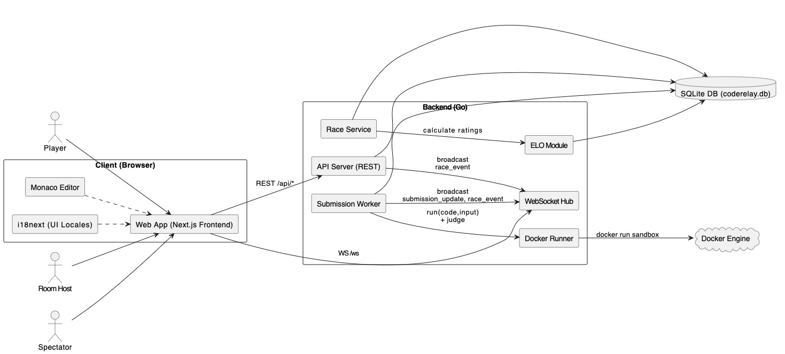
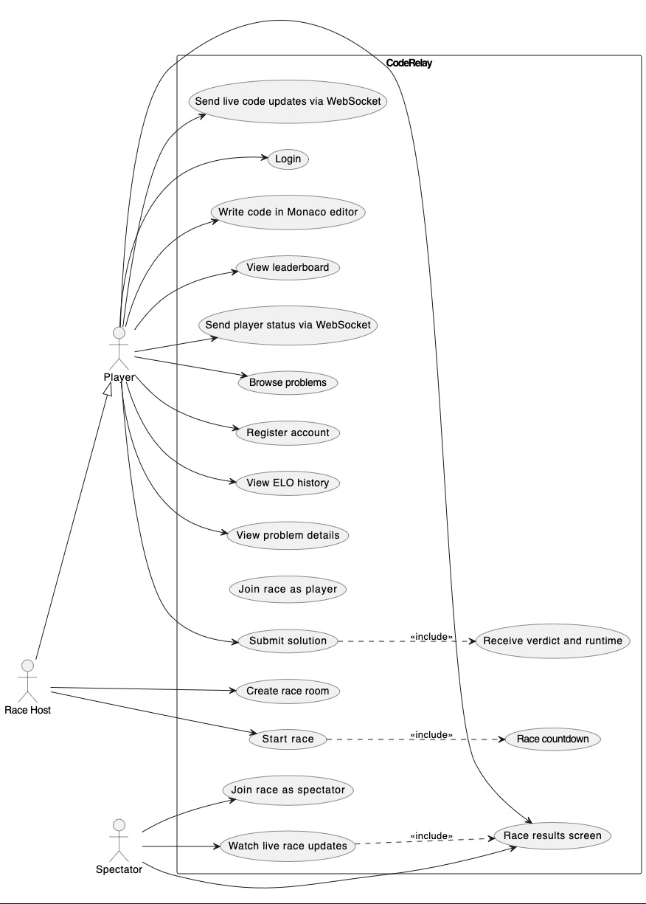
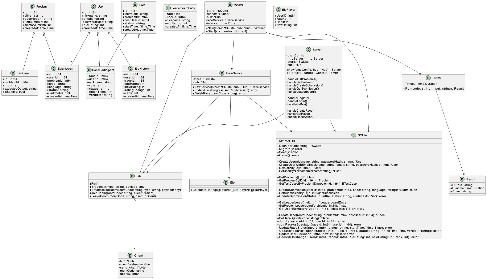
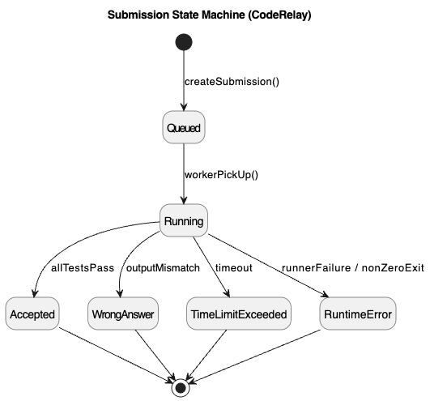
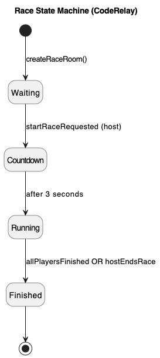

# Assignment for Quality Assessments and Measurements of SQA Using IDEAL Model  
## CodeRelay — Competitive Coding Race Platform (SE2)

**Course / Module:** SE2 — Software Quality Assurance (SQA)  
**Date:** 15 January 2026  
**Document Version:** 1.0 (Final)

**Group Members (Name — Student ID):**
- Deniz Can Calkin — 79745817  
- Ömer Duran — 45096997  
- Bruna Pierobon — 69903271  
- Julia Correia Bindi — 25361003  

---

## Table of Contents
- [Assignment for Quality Assessments and Measurements of SQA Using IDEAL Model](#assignment-for-quality-assessments-and-measurements-of-sqa-using-ideal-model)
  - [CodeRelay — Competitive Coding Race Platform (SE2)](#coderelay--competitive-coding-race-platform-se2)
  - [Table of Contents](#table-of-contents)
- [1. Task 1: Software Goal, QA Criteria, and Assessment Techniques](#1-task-1-software-goal-qa-criteria-and-assessment-techniques)
  - [1.1 Project Goal Definition](#11-project-goal-definition)
    - [Project Goals (G1..G6)](#project-goals-g1g6)
  - [1.2 System Architecture and Components](#12-system-architecture-and-components)
    - [Architecture Overview](#architecture-overview)
    - [Component Table](#component-table)
    - [Database Schema (SQLite)](#database-schema-sqlite)
  - [1.3 Quality Assurance Criteria](#13-quality-assurance-criteria)
  - [1.4 Workflow Diagrams](#14-workflow-diagrams)
    - [Architecture / Component Diagram](#architecture--component-diagram)
    - [Use Case Diagram](#use-case-diagram)
    - [Class Diagram (optional, if you keep it)](#class-diagram-optional-if-you-keep-it)
    - [FSM — Submission Lifecycle](#fsm--submission-lifecycle)
    - [FSM — Race Lifecycle](#fsm--race-lifecycle)
- [2. Task 2: Test Plan Documentation](#2-task-2-test-plan-documentation)
  - [2.1 Requirement Analysis and Definition](#21-requirement-analysis-and-definition)
    - [Functional Requirements (FR)](#functional-requirements-fr)
    - [Non-Functional Requirements (NFR)](#non-functional-requirements-nfr)
    - [Error Categories and Priorities](#error-categories-and-priorities)
    - [Normal vs Abnormal Runtime Distinction](#normal-vs-abnormal-runtime-distinction)
    - [Known Defects / Technical Debt (Status)](#known-defects--technical-debt-status)
  - [Goal-to-Requirement Traceability (Mapping)](#goal-to-requirement-traceability-mapping)
  - [2.2 Design and Development Checklist](#22-design-and-development-checklist)
    - [Module-Based Checklist](#module-based-checklist)
  - [2.3 Testing and Release Metrics](#23-testing-and-release-metrics)
    - [Timing Metrics](#timing-metrics)
    - [Frequency Metrics](#frequency-metrics)
    - [Error Metrics](#error-metrics)
  - [2.4 IDEAL Model Implementation Phases](#24-ideal-model-implementation-phases)
    - [Initiating](#initiating)
    - [Diagnosing](#diagnosing)
    - [Establishing](#establishing)
    - [Acting](#acting)
    - [Learning](#learning)
- [3. Task 3: Reflection and Learning](#3-task-3-reflection-and-learning)
  - [3.1 Use Case Modeling Evaluation](#31-use-case-modeling-evaluation)
  - [3.2 Development Process Evaluation](#32-development-process-evaluation)
  - [3.3 Lessons Learned](#33-lessons-learned)
- [4. Appendices](#4-appendices)
  - [Appendix A: Test Scenarios](#appendix-a-test-scenarios)
    - [Authentication](#authentication)
    - [Submissions](#submissions)
    - [Races](#races)
    - [WebSocket](#websocket)
  - [Appendix B: Performance Test Results Template](#appendix-b-performance-test-results-template)
  - [Appendix C: API Endpoint Reference](#appendix-c-api-endpoint-reference)
  - [Appendix D: WebSocket Message Reference](#appendix-d-websocket-message-reference)
    - [Client → Server](#client--server)
    - [Server → Client](#server--client)

---

# 1. Task 1: Software Goal, QA Criteria, and Assessment Techniques
*(QP, Initiate)*

## 1.1 Project Goal Definition

CodeRelay is a web platform where users solve coding problems and also join **real-time race rooms**. Players write Python code in the browser, submit it, and receive verdicts (AC/WA/TLE/RE) with runtime. Hosts can start races, and spectators can watch live progress through WebSocket updates.

| Aspect | Description |
|---|---|
| Project Goal | Build a reliable competitive coding platform with problem solving, race rooms, and ELO-based ranking. |
| Domain | Competitive Programming / EdTech / Real-time Web Application |
| Main Scenario | User registers or logs in, opens a problem, writes code, submits, and receives results. Users can create/join/start race rooms and watch live updates. |
| Stakeholders | Players, Room Hosts, Spectators, Developers (maintenance). |
| In Scope | Auth (register/login/me), problems, submissions + worker judging, races, leaderboard, WebSocket live events. |
| Out of Scope (current version) | Admin UI for creating problems, strict authorization for every endpoint, CI/CD automation. |

### Project Goals (G1..G6)

- **G1 — Correctness:** The system must judge solutions correctly (AC/WA/TLE/RE) using test cases.  
- **G2 — Reliability:** The system must keep consistent states in the database and must not leave submissions stuck.  
- **G3 — Performance:** API responses and judging should be fast enough for a smooth user experience.  
- **G4 — Security:** User code must run in a safe sandbox (Docker, no network, resource limits).  
- **G5 — Usability:** Users should easily understand the flow: login → problem → editor → submit → result.  
- **G6 — Maintainability:** The codebase should stay modular and easy to update (clear separation of modules).  

---

## 1.2 System Architecture and Components

### Architecture Overview
- **Frontend:** Next.js (React) UI with Monaco Editor.  
- **Backend:** Go REST API + WebSocket endpoint.  
- **Database:** SQLite (`coderelay.db`).  
- **Judging:** Background worker processes queued submissions and executes code in Docker (`coderelay-runner`).  
- **Real-time:** WebSocket hub broadcasts submission updates and race events.

### Component Table

| Component | Technology | Purpose |
|---|---|---|
| Frontend Web App | Next.js (React) | UI for auth, problems, races, spectator view |
| Code Editor | Monaco Editor | In-browser coding |
| Backend API | Go `net/http` | REST endpoints for problems, submissions, races, users |
| WebSocket | Gorilla WebSocket | Live updates (submission updates, race events, code/status forwarding) |
| Worker | Go background loop | Picks queued submissions, runs runner, writes results |
| Docker Runner | Docker Engine | Safe execution with limits |
| Database | SQLite | Stores users, problems, test cases, submissions, races, ELO history |

### Database Schema (SQLite)

| Table | Description | Key Fields |
|---|---|---|
| `users` | Users/players | `id`, `nickname`, `email`, `password_hash`, `elo_rating`, `created_at` |
| `problems` | Coding problems | `id`, `title`, `description`, `time_limit_ms`, `memory_limit_mb`, `created_at` |
| `test_cases` | Test cases per problem | `id`, `problem_id`, `input`, `expected_output`, `is_sample` |
| `submissions` | Code submissions | `id`, `user_id`, `problem_id`, `code`, `language`, `status`, `runtime_ms`, `created_at` |
| `submission_audit` | Submission status history | `id`, `submission_id`, `status`, `created_at` |
| `races` | Race rooms | `id`, `room_code`, `problem_id`, `host_user_id`, `status`, `start_time`, `created_at` |
| `race_participants` | Players/spectators in race | `race_id`, `user_id`, `role`, `status`, `finish_time`, `verdict` |
| `elo_history` | ELO changes | `id`, `user_id`, `race_id`, `old_rating`, `new_rating`, `rating_change`, `rank`, `created_at` |

**Important Clarification (implementation):**
- `time_limit_ms` is applied to the runner timeout.  
- `memory_limit_mb` exists in DB, but is **not applied** per problem. Runner uses a default memory limit (see Known Defects).  

---

## 1.3 Quality Assurance Criteria

| QA Criteria | Assessment Technique | Description (CodeRelay Context) |
|---|---|---|
| Reliability | Logs review, DB checks, failure tests | Submissions must progress to a final state; race state must stay consistent |
| Usability | Scenario walkthrough, small UAT | Clear flow for new users; users can find submit/results easily |
| Performance | Timing measurements, load tests | API response time, verdict time (queued→final), WS stability |
| Security | Checklist + negative tests | bcrypt password hashing, JWT endpoints, Docker sandbox (no network, limits) |
| Maintainability | Code review checklist | Modular structure improves changes and debugging |

---

## 1.4 Workflow Diagrams

> You already created diagrams. Put the exported images in the same folder as this Markdown so the PDF renderer can show them.

### Architecture / Component Diagram

### Use Case Diagram

### Class Diagram (optional, if you keep it)

### FSM — Submission Lifecycle

### FSM — Race Lifecycle

---

# 2. Task 2: Test Plan Documentation
*(QA Initiate, Diagnose, Establish, Act)*

## 2.1 Requirement Analysis and Definition

### Functional Requirements (FR)

| ID | Requirement | Module | Priority |
|---|---|---|---|
| FR-001 | Register with nickname + password and return a token | Auth | High |
| FR-002 | Login with nickname + password and return a token | Auth | High |
| FR-003 | Get current user via token (`/api/auth/me`) | Auth | High |
| FR-004 | List problems | Problems | High |
| FR-005 | View problem details (statement + sample cases) | Problems | High |
| FR-006 | Create a submission (saved as `queued`) | Submissions | High |
| FR-007 | Worker judges submission and stores verdict + runtime | Worker/Runner | High |
| FR-008 | Get submission by id (poll until final) | Submissions | High |
| FR-009 | Create race room (room code) | Races | High |
| FR-010 | Join race as player | Races | High |
| FR-011 | Join race as spectator | Races | Medium |
| FR-012 | Start race (host only) | Races | High |
| FR-013 | WebSocket provides live updates | WebSocket | High |
| FR-014 | View leaderboard (problem ranking and/or ELO ranking) | Leaderboard | Medium |
| FR-015 | View ELO history (`/api/users/{id}/elo-history`) | Users/ELO | Medium |

### Non-Functional Requirements (NFR)

| ID | Requirement | Category | Measurement Criteria |
|---|---|---|---|
| NFR-001 | REST API response time | Performance | Average < 500ms (local) |
| NFR-002 | Verdict time (queued → final) | Performance | Usually < 10 seconds (local) |
| NFR-003 | Worker polling interval | Performance | 1 second |
| NFR-004 | WebSocket ping period | Reliability | ~54 seconds |
| NFR-005 | Password hashing | Security | bcrypt hash only |
| NFR-006 | JWT validity | Security | 7 days |
| NFR-007 | Sandbox execution | Security | Docker: `--network none`, read-only FS, pids/cpu/memory limits |
| NFR-008 | Execution time limit | Performance | Uses `time_limit_ms` |
| NFR-009 | Data integrity | Reliability | DB updates consistent for submission/race states |

---

### Error Categories and Priorities

| Error Type | Description | Priority | Resolution Time |
|---|---|---:|---|
| Critical (P1) | Crash, data loss, judging not possible | Urgent | < 4 hours |
| High (P2) | Main flow broken (login, submit, join race) | High | < 24 hours |
| Medium (P3) | Partial feature issue or dev security config | Medium | < 72 hours |
| Low (P4) | UI/cosmetic issues | Low | Next release |

---

### Normal vs Abnormal Runtime Distinction

| Condition | Normal Behavior | Abnormal Behavior (**ERROR**) |
|---|---|---|
| Submission state | queued → running → final verdict | Stuck in queued/running |
| Runner output | Output matches expected → AC | Output mismatch → WA |
| Runner timeout | Stops within time limit | Over time limit → TLE |
| Runner execution | Successful exit | Non-zero exit / docker failure → RE |
| Race start | Host starts, countdown 3s | Non-host start → 403 |
| WebSocket | Connected and receives events | Disconnect loop / missing events |

---

### Known Defects / Technical Debt (Status)

| ID | Item | Status | Priority |
|---|---|---|---|
| D001 | Leaderboard page route exists in current repo (`frontend/app/leaderboard/page.js`) | Fixed | — |
| D002 | CORS allows `Access-Control-Allow-Origin: *` (dev configuration) | Open | P3 |
| D003 | WebSocket origin check allows all origins (dev configuration) | Open | P3 |
| D004 | Authorization gap: many endpoints work with `user_id` in body; JWT mainly used for `/api/auth/me` | Open | P2–P3 |
| D005 | Memory limit mismatch: runner default memory is used (e.g., 256MB), but `problem.memory_limit_mb` is not applied | Open | P3 |
| D006 | Frontend automated tests are missing (manual checklist only) | Open | P3 |
| D007 | WS documentation mismatch: `docs/ws-verdict-contract.md` does not match active WS message types | Open | P3 |

---

## Goal-to-Requirement Traceability (Mapping)

| Goal | Goal Statement | Related FR IDs | Key Test Scenarios | Metrics to Track |
|---|---|---|---|---|
| G1 | Correct judging with correct verdicts | FR-004, FR-005, FR-006, FR-007, FR-008 | TC-SUB-AC, TC-SUB-WA, TC-SUB-TLE, TC-SUB-RE | Verdict accuracy, RE/TLE rate, stuck submissions = 0 |
| G2 | Reliable states and no stuck records | FR-006, FR-007, FR-008, FR-013 | TC-SUB-POLL, TC-WS-RECONNECT, TC-SUB-IMAGE | Stuck count, DB error rate, WS disconnect rate |
| G3 | Good performance for API + judging | FR-004, FR-006, FR-007, FR-013 | TC-PERF-API, TC-PERF-VERDICT | API response time, verdict time, worker throughput |
| G4 | Safe execution and basic security | FR-001, FR-002, FR-003, FR-007 | TC-AUTH-LOGIN, TC-AUTH-ME, TC-SUB-SANDBOX | Unauthorized rate, sandbox checklist pass |
| G5 | Simple and clear user flow | FR-001..FR-008, FR-009..FR-013 | TC-UAT-01, TC-UAT-02, TC-UAT-03 | Task success rate, time-to-complete flow |
| G6 | Easy to maintain and improve | Supporting all FRs | Code review + regression set (auth + submit + race) | Lint results, backend tests pass, regression defects |

---

## 2.2 Design and Development Checklist

### Module-Based Checklist

| Activity | Inspection/Test | Release Status | QC Implementation |
|---|---|---|---|
| Auth | Register/login/me works with correct errors | Active | Manual tests + endpoint tests |
| Problems | List + detail shows correctly | Active | Endpoint tests |
| Submissions | Create + poll until final verdict | Active | Worker + DB checks |
| Runner | Sandbox limits configured | Active | Security checklist |
| Races | Create/join/watch/start works | Active | Race scenario tests |
| WebSocket | Join room, receive events, forward code/status | Active | WS scenario tests |
| Frontend navigation | Sidebar links valid | Active | Manual UI test |
| Frontend automation | Jest/Playwright | Missing | Add in next iteration |

---

## 2.3 Testing and Release Metrics

### Timing Metrics

| Metric | Target | Result |
|---|---:|---|
| `/api/problems` response time | < 200ms | Pending |
| `/api/submissions` create response | < 300ms | Pending |
| queued → final verdict time | < 10s (local) | Pending |
| WS connect time | < 200ms | Pending |

### Frequency Metrics

| Metric | Value |
|---|---:|
| Worker poll interval | 1 second |
| WS ping period | ~54 seconds |
| Race countdown | 3 seconds |
| WS reconnect delay (frontend) | 3 seconds |

### Error Metrics

| Metric | Threshold |
|---|---:|
| API error rate (4xx+5xx) | < 1% |
| WS disconnect rate | < 1 per hour |
| Submission RE rate | < 2% (local) |
| Stuck submissions (queued/running) | 0 |

---

## 2.4 IDEAL Model Implementation Phases

### Initiating
- Defined scope, users, and goals (G1–G6).
- Defined QA criteria and test plan structure.

### Diagnosing
- Identified technical debt and risks (Known Defects D002–D007).
- Confirmed important constraints: single worker loop, SQLite database, Docker sandbox.

### Establishing
- Created checklists, requirements tables, mapping, and test scenario IDs.
- Defined metrics and thresholds.

### Acting
- Execute: endpoint tests, WS tests, race scenarios, and manual UAT flows.
- Measure performance metrics and record results in Appendix B.

### Learning
- Use defect log and metric results to improve: authorization, WS contract docs, frontend tests, and deployment configs.

---

# 3. Task 3: Reflection and Learning

## 3.1 Use Case Modeling Evaluation
Use case modeling helped us separate roles (host, player, spectator). It made the race flow and WebSocket responsibilities clearer.

## 3.2 Development Process Evaluation
The system is easier to maintain because backend features are separated (server, storage, worker, WS, runner, race, elo). This reduces debugging time.

## 3.3 Lessons Learned

| Area | Lesson | Action |
|---|---|---|
| Authorization | Using `user_id` is not enough for real security | Add middleware and enforce JWT on protected endpoints |
| Real-time | Reconnect works, but state sync needs clarity | Add a “room_state” sync message or re-fetch on reconnect |
| Docs | WS contract doc must match real message types | Update or replace outdated doc |
| Testing | Missing frontend tests increases risk near deadline | Add minimal automated test suite early |

---

# 4. Appendices

## Appendix A: Test Scenarios

### Authentication
| ID | Scenario | Steps | Expected |
|---|---|---|---|
| TC-AUTH-LOGIN | Login success + fail | Login with correct/wrong password | 200 OK / 401 Unauthorized |
| TC-AUTH-ME | Token required | Call `/api/auth/me` with/without token | 200 OK / 401 Unauthorized |

### Submissions
| ID | Scenario | Steps | Expected |
|---|---|---|---|
| TC-SUB-AC | Correct solution → AC | Submit correct code | Final verdict AC |
| TC-SUB-WA | Wrong output → WA | Submit wrong code | Final verdict WA |
| TC-SUB-TLE | Infinite loop → TLE | Submit loop code | Final verdict TLE |
| TC-SUB-RE | Runtime failure → RE | Submit error code | Final verdict RE |
| TC-SUB-POLL | Poll until final | GET submission until final | Status changes to final |
| TC-SUB-IMAGE | Missing docker image | Remove/stop runner image and submit | docker fails → RE (document logs) |
| TC-SUB-SANDBOX | Sandbox check | Try network access in code | Should fail (no network) |

### Races
| ID | Scenario | Steps | Expected |
|---|---|---|---|
| TC-RACE-001 | Non-host start forbidden | Start race with non-host user | 403 Forbidden |
| TC-RACE-START | Host starts race | Host calls start | Countdown then running |
| TC-UAT-02 | Race flow | Create → join → start → submit | Live updates + final results |

### WebSocket
| ID | Scenario | Steps | Expected |
|---|---|---|---|
| TC-WS-RECONNECT | Reconnect | Disconnect WS and wait | Reconnect after ~3s |
| TC-WS-LIVE | Live updates | Join room, submit | Receive `race_event` / `submission_update` |
| TC-UAT-03 | Spectator watch | Open spectator view | Receives live progress |

---

## Appendix B: Performance Test Results Template

| Test | Metric | Target | Result | Status |
|---|---|---:|---:|---|
| Problems list | Response time | < 200ms | - | Pending |
| Submission create | Response time | < 300ms | - | Pending |
| Verdict time | queued→final | < 10s | - | Pending |
| WS connect | Connect time | < 200ms | - | Pending |

---

## Appendix C: API Endpoint Reference

| Endpoint | Method | Description |
|---|---:|---|
| `/healthz` | GET | Health check |
| `/api/problems` | GET | List problems |
| `/api/problems/{id}` | GET | Problem details |
| `/api/submissions` | POST | Create submission |
| `/api/submissions/{id}` | GET | Get submission status/result |
| `/api/leaderboard` | GET | Leaderboard (ELO or problem ranking via query) |
| `/api/users/{id}` | GET | User info |
| `/api/users/{id}/elo-history` | GET | ELO history (correct path) |
| `/api/auth/register` | POST | Register |
| `/api/auth/login` | POST | Login |
| `/api/auth/me` | GET | Current user from JWT |
| `/api/races` | POST | Create race |
| `/api/races/{code}` | GET | Race details |
| `/api/races/{code}/join` | POST | Join as player |
| `/api/races/{code}/watch` | POST | Join as spectator |
| `/api/races/{code}/start` | POST | Start race (host only) |
| `/ws` | GET | WebSocket |

---

## Appendix D: WebSocket Message Reference

### Client → Server
| Type | Fields | Notes |
|---|---|---|
| `join_room` | `room_code`, `user_id` | Subscribe client to a room |
| `code_update` | `room_code`, `user_id`, `payload` | Forwarded to room |
| `player_status` | `room_code`, `user_id`, `payload` | Forwarded to room |

### Server → Client
| Type | Payload | Notes |
|---|---|---|
| `submission_update` | `{ submission_id, user_id, problem_id, status, runtime_ms? }` | Worker broadcasts on state changes |
| `race_event` | `{ event: "...", ... }` | Race lifecycle + ELO updates |
| `code_update` | forwarded payload | From other clients |
| `player_status` | forwarded payload | From other clients |

**Documentation note:** If `docs/ws-verdict-contract.md` still describes different types (e.g., `match.verdict`), it should be updated to match this active contract.

---
